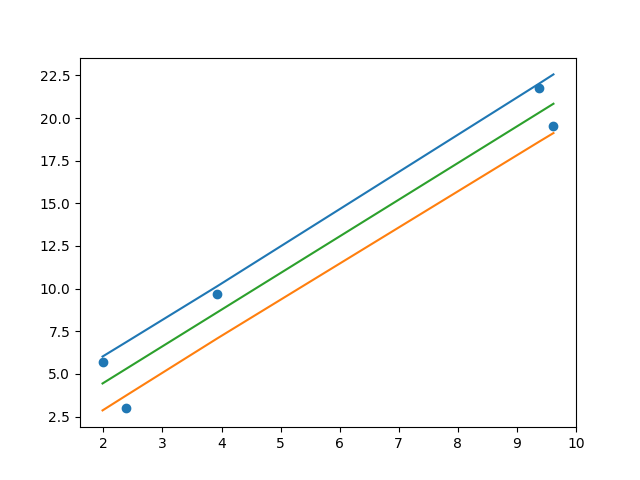

# Bayesian Linear Regression

A simple implementation of Bayesian Linear Regression, based on the book "Pattern Recognition and Machine Learning"

## How to run

1) Install the python modules via requirement.txt file.
2) Run the Jupyter Notebooks.